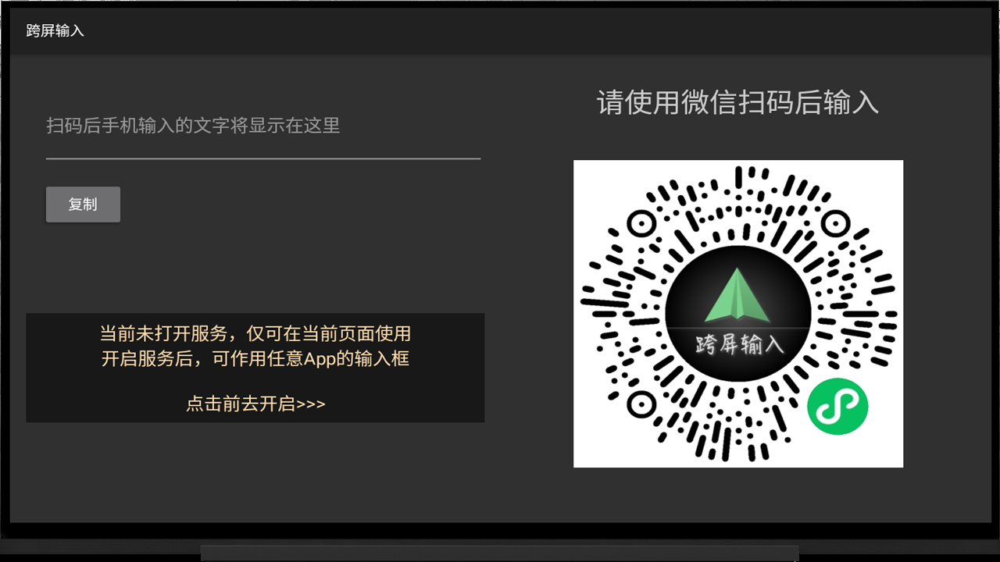
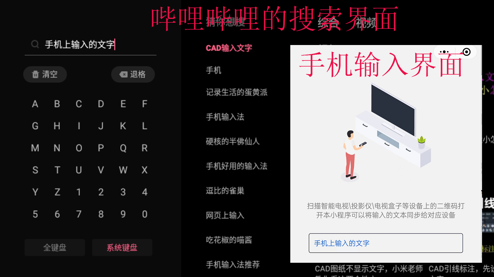

# android_tv_remote_input

将手机上输入的内容同步到Android TV上任意界面的输入框内

## 实现原理：

- 手机通过二维码获取TV上的push注册的token
- 然后通过push方式将文字发送到电视端
- 电视端通过AccessibilityService获取当前界面上editable的控件
- 因为很多盒子还停在android 4.4版本上，所以采用剪贴板的方式填充进edittext

## 预览

 

- bilibili的搜索界面上使用手机输入

/mpToken.php 获取微信小程序的asscess_token
用来生成二维码图片

## License
- 请随意